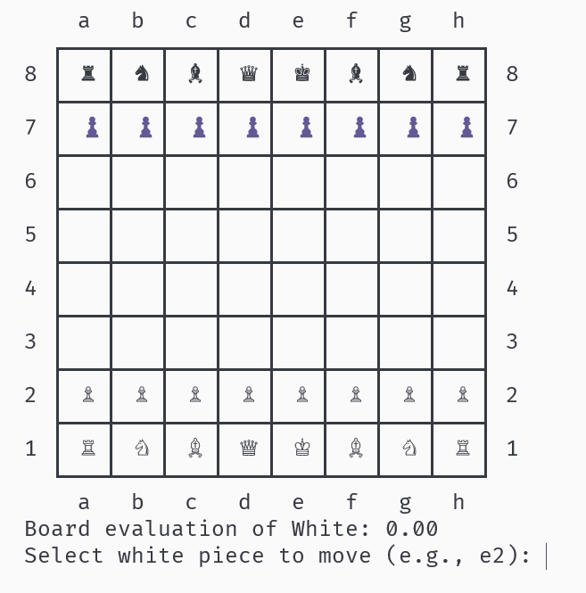
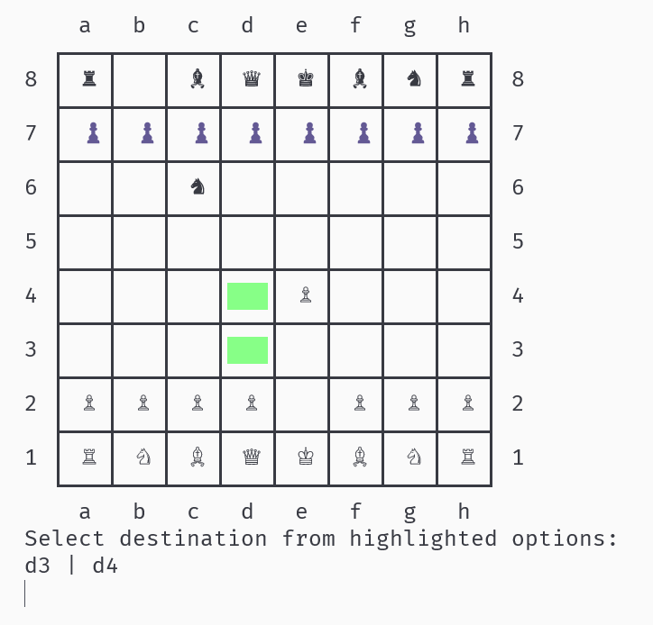
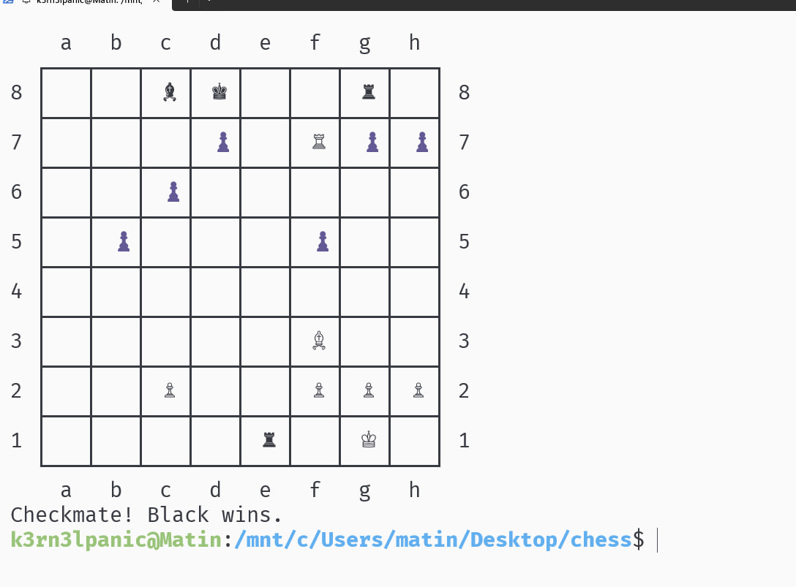

# 🧠 C Chess Engine (Minimax + Console Interface)

A full-featured **C chess engine** playable in the terminal — with **Unicode board drawing**, **AI opponent** powered by **Minimax with alpha–beta pruning**, and full support for **castling**, **pawn promotion**, and **checkmate/stalemate detection**.

Estimated Chess.com rating based on Rating bots: 1700-2000

---

## 📸 Preview

> 🖼️ *Board Rendering Example:*
> 

> 🖼️ *Gameplay Example (Player vs AI):*
> 

---

## ⚙️ Features

✅ Fully playable CLI chess game  
✅ Minimax AI with alpha–beta pruning  
✅ Legal move generation & validation  
✅ Check, checkmate, stalemate detection  
✅ Castling and pawn promotion (auto-queen)  
✅ Threefold repetition detection  
✅ Cross‑platform: Windows / Linux / macOS  
✅ Clean modular C codebase split into `.c` / `.h` files

---

## 🗂️ Project Structure

```
chess/
├── main.c          # CLI entry point
├── board.c/.h      # Board representation, rules, move application
├── movegen.c/.h    # Move generation & legality filtering
├── ai.c/.h         # Minimax AI logic and evaluation
├── util.c/.h       # Console drawing & input utilities
└── README.md       # Project documentation
```

---

## 🧩 How It Works

The engine maintains an internal 8×8 board array of `Cell` structures, each containing:

- `state`: `'W'`, `'B'`, or `'E'` (empty)
- `piece`: `'P'`, `'R'`, `'N'`, `'B'`, `'Q'`, `'K'`

Each move triggers:

1. **Move generation** → via `get_available_moves()`
2. **Legality filtering** → removing self‑check moves
3. **Evaluation** → using material balance + game state
4. **Minimax recursion** → to choose the optimal AI move

---

## 🧱 Build Instructions

### 🔧 Dependencies

- GCC or Clang

### 🏗️ Build

```bash
gcc main.c board.c move_gen.c ai.c util.c -o chess -lm
```

### ▶️ Run

```bash
./chess
```

---

## 🎮 Gameplay Instructions

- You play **White**, the AI plays **Black**.
- Input moves via coordinates (e.g., `e2`, `e4`).
- Legal moves for each selected piece are highlighted in the terminal.
- The game auto‑promotes pawns to queens.
- Castling, check, and stalemate are supported.

---

## 🧠 AI Configuration

AI depth is configurable in `engine()`:

```c
int status = engine(&board, 'B', 5); // depth = 5
```

Increasing depth yields stronger but slower play.

---

## 🧑‍💻 Author

Developed by **Matin (k3rn3lpanic)**  
GitHub: [https://github.com/k3rn3lpanicc](https://github.com/k3rn3lpanicc)

---

## 📄 License

This project is released under the **MIT License**.  
See `LICENSE` for more details.

---

## 🖼️ Screenshots (Placeholders)



---

*Feel free to contribute or improve the AI logic (evaluation heuristics, opening books, etc.)!*
